# NPC Civilians

Adds "Civilian" human NPCs to the game.

All characters were created by khzmusik, using assets that are either free for re-use or CC-BY.
See the Technical Details section for more information and asset credits.

## Civilians

The pack contains these characters:

### Test Female
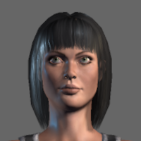

### Test Male
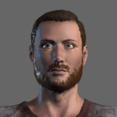

### Female Aged
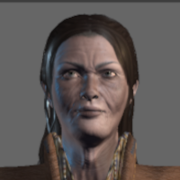

### Female Scrubs
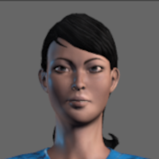

### Female Young 1
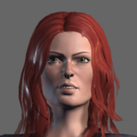

### Female Young 2
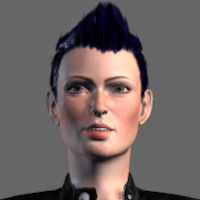

### Female Young 3
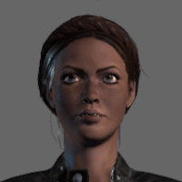

### Female Young 4
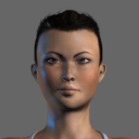

### Female Young 5
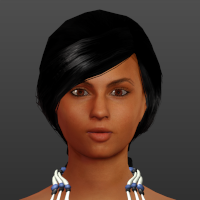

### Male Aged
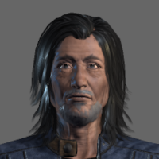

### Male Aged Scrubs
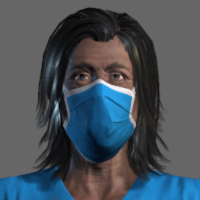

### Male Aged 2
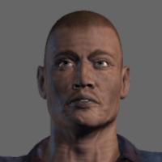

### Male Cowboy
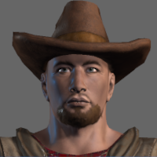

### Male Young 1
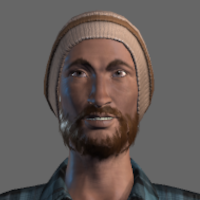

### Male Young 2
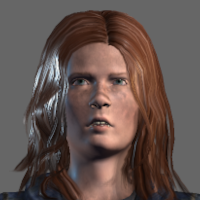

### Male Young 3
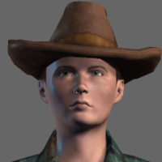

All of them are in the Whiteriver faction, and can be hired.

**Most** characters can wield all supported NPC weapons.
The exception is Female Young 2, who cannot wield a rocket launcher.

## Dependent and Compatible Modlets

This modlet is dependent upon the `0-NPCCore` modlet,
and that modlet is in turn dependent upon the `0-SCore` modlet.

So far as I am aware, it should work with any versions of those modlets.

## Technical Details

This modlet includes new non-XML resources (Unity assets).
These resources are _not_ pushed from server to client.
For this reason, this modlet should be installed on both servers and clients.

### Spawning

Spawning follows the NPC Core conventions.

According to those conventions, each NPC pack has its own biome spawners,
which are "gamestaged" by biome difficulty, time of day (daytime/nighttime),
and district (downtown vs. non-downtown).
NPCs also spawn into the groups used by NPC prefabs (POIs).

As of version 1.0, spawn probabilities were calculated, and XPath was generated,
using the [NPC Probabilator](../2-khzmusik_NPC_Probabilator) tool.

See that tool's [README](../2-khzmusik_NPC_Probabilator/README.md) file for details.

### Bandit versions

There are bandit versions of these characters, for those who want them.
But I assumed most people did not want them, so they are not enabled by default.

In the `Config` folder of this pack, there are additional XML files:

* `entityclasses-bandits.xml`: contains bandit versions of the civilian entities
* `entitygroups-bandits.xml`: spawns the bandit versions into entity groups
* `spawning-bandits.xml`: adds biome spawning for bandit entity groups

There are different ways you can use them:

* If you want **only** the bandit versions, and _not_ the civilian versions,
    rename the existing `entityclasses.xml`, `entitygroups.xml`, and `spawning.xml` files,
    then rename the bandit versions to `entityclasses.xml`, `entitygroups.xml`, and `spawning.xml`.
* If you want **both** civilian and bandit versions,
    you can uncomment XML tags in the _existing_ files in this mod:
    * In `entityclasses.xml`, uncomment this line at the end of the file:
        ```xml
        <include filename="entityclasses-bandits.xml" />
        ```
    * In `entitygroups.xml`, uncomment this line at the end of the file:
        ```xml
        <include filename="entitygroups-bandits.xml" />
        ```
    * In `spawning.xml`, uncomment this line at the end of the file:
        ```xml
        <include filename="spawning-bandits.xml" />
        ```
    These will automatically included the bandit versions of the files.
    (You must un-comment _all_ of those lines.)

The bandit versions spawn into different entity groups used by NPC sleeper volumes:

* `npcBandits*`
* `npcEnemy*`

They also have dedicated biome spawn groups, separate from the civilian biome spawn groups.

As per usual with my enemy entities, they can be "basic" or "advanced" versions.
The "basic" versions can't be interacted with or hired, but can be spawned into hordes.
The "advanced" versions can be interacted with or hired - provided your faction standing is good enough -
but cannot be spawned into hordes.

I assume most players want the "basic" enemies,
since they usually do not use mods that change faction relationships.
But if you don't, un-comment the XML at the bottom of the `entityclasses-bandits.xml` file.

### How the characters were created

The character models were created using one of two programs:

* Mixamo Fuse - a free program for making human-like characters.
    Unfortunately, after Adobe bought it, it was discontinued and is no longer supported.
    But it can still be used, and is still very good.
* [MakeHuman](http://www.makehumancommunity.org) -
    an open source program for making human characters.
    It includes many community assets.

Once the models were created, I exported them to `.obj` files, and rigged them in either
[Mixamo](https://www.mixamo.com) or [AccuRIG](https://actorcore.reallusion.com/auto-rig/accurig).
Afterwards, I exported them to Unity `.fbx` files.

I then imported them into Unity to set up ragdolls, add controllers, tags, material shaders, etc.

None of this would be possible were it not for the help of Xyth and Darkstardragon - thank you!

If you would like to know how to do all this yourself,
Xyth has an excellent series of tutorials on YouTube:

https://www.youtube.com/c/DavidTaylorCIO/playlists

### Re-use in other mods/modlets

Any rights that I hold in these characters, I hereby place into the public domain (CC0).
Feel free to re-use them in any of your mods or modlets.

However, I don't hold the rights to all the assets in the models.
I have used assets from Mixamo Fuse and MakeHuman, and do not hold any rights in those assets.
Those rights are retained by Fuse, and/or the members of the MakeHuman community.

This sounds worse than it is.
Both the Fuse and MakeHuman assets are released under very lenient licenses,
and it should not be any problem for mod authors to include them in their mods:

* Characters created in Mixamo Fuse may be used in any game (commerical or not) for free,
    though you cannot repackage and sell the Fuse assets themselves.
* MakeHuman characters can include assets from the MakeHuman team, or community assets.
    The MakeHuman assets are CC0, and the community assets are usually CC0 or CC-BY.
    Distribution of characters that include CC-BY assets **must** abide by the terms of that license,
    and include appropriate credits for those assets.

Obviously, the characters also use assets from The Fun Pimps (sounds, animations, etc).
The Fun Pimps retain the rights in those assets.

So long as you are using these characters in the context of a 7D2D mod, there should be no issues.

### Asset Credits

These assets were used in the creation of the characters in this modlet.
The assets were created for, and used in, MakeHuman.

> :warning: If you are using the characters from this mod, you **must** credit these authors.
> If you are including my mod in an overhaul or mod pack,
> it should be sufficient to make sure this README.md file is included.

* **Double MH Braid 01**  
    author:  Elvaerwyn  
    license: [CC0](https://creativecommons.org/share-your-work/public-domain/cc0) 
* **Eve Hill's Young_Hispanic_Female**  
    author: Eve Hill Sisters Production Company / 3d.sk / jimlsmith9999  
    license: license: [CC-BY](https://creativecommons.org/licenses/by/2.0/) 
* **Necklace (Native American Fashion)**  
    author:  punkduck  
    license: [CC-BY](https://creativecommons.org/licenses/by/2.0/) 
* **Retro Top**  
    author:  punkduck  
    license: [CC-BY](https://creativecommons.org/licenses/by/2.0/) 
* **Skirt (Native American Fashion)**  
    author:  punkduck  
    license: [CC-BY](https://creativecommons.org/licenses/by/2.0/) 
* **String 4**  
    author:  punkduck  
    license: [CC-BY](https://creativecommons.org/licenses/by/2.0/) 

If I have missed any assets used in these characters, please let me know,
and I will credit the author or remove the character, as appropriate.
