# Rogues

Adds "Rogue" human NPCs to the game.
Rogues are part of the Bandits faction.

All characters were created by me (khzmusik), using assets that are either free for re-use or CC-BY.
See the Technical Details section for more information and asset credits.

[[_TOC_]]

## Features

* Eight Rougue characters
* Custom AI (crouching between attacks, thrashing around when on fire, etc.)
* "Basic" versions (enabled by default) or "advanced" versions (not enabled by default)
* Rogue camps used as biome decorations
* _For prefab creators:_ Rogue sleeper volume spawn groups
  (separate from the NPC Core Bandit groups)
* _For modders:_ Custom wandering horde groups (not enabled by default)
* _For modders:_ XML to make "advanced" Rogue characters part of the non-enemy Whiteriver faction
  (not enabled by default)
* If using "advanced" Rogues (enemy or civilian),
  custom dialog with backstories and personal histories

## Characters

The pack contains these "Rogue" characters:

---

### Rogue Female Aged
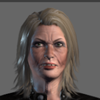

---

### Rogue Female Heavy
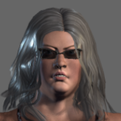

---

### Rogue Female Leather 1
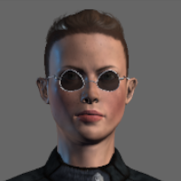

---

### Rogue Female Leather 2
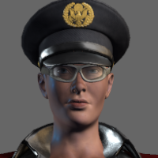

---

### Rogue Male Aged
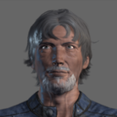

---

### Rogue Male Blonde
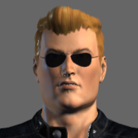

---

### Rogue Male Cowboy
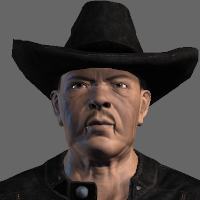

---

### Rogue Male Young
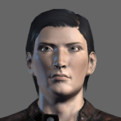

---

Every Rogue character can wield all supported NPC weapons.

## Decoration Prefabs

This pack contains prefabs that are used as biome decorations.
They spawn _only_ Rogues.

Because they are biome decorations, they spawn when the chunk is generated, and not during RWG.
This means they can spawn into pre-generated maps, such as Navezgane.

I have tried my best to make it a rare event to encounter one of these prefabs.
Players will probably encounter only one or two of each, depending upon biome.

If you want to change their spawn probabilities,
you can edit this mod's `biomes.xml` file.
If you want to prevent them from spawning altogether,
that entire file can be commented out or just deleted.

---

### Rogue Camp 1
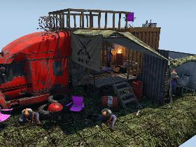

Spawns in the Desert biome.

---

### Rogue Camp 2
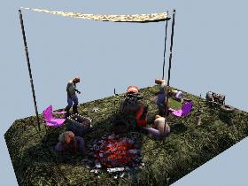

Spawns in the Desert biome.

---

### Rogue Camp 3
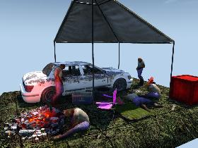

Spawns in the Pine Forest and Desert biomes.

---

### Rogue Camp 4
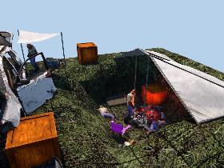

Spawns in the Snow biome.

---

### Rogue Camp 5
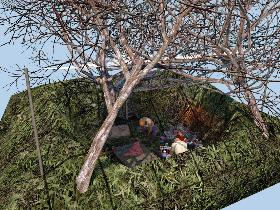

Spawns in the Snow biome.

---

### Rogue Camp 6
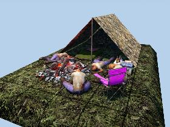

Spawns in the Pine Forest biome.

## Dependent Mods

This NPC pack is dependent upon the `0-NPCCore` mod,
and that mod is in turn dependent upon the `0-SCore` mod.

## Technical Details

This NPC pack includes new non-XML resources (Unity assets).
These resources are _not_ pushed from server to client.
For this reason, this NPC pack must be installed on both servers and clients.

While this NPC pack does not contain custom C# code, the mods it depends upon do.
You **must** run 7 Days To Die with **EAC off.**

### Spawning

Rogues spawn into these biomes:
  * the winter biome, if their clothing is appropriate
  * the desert biome, if their clothing is inappropriate for the winter biome
  * cities, both non-forest and forest, day and night

Rogues are also spawned into the NPC Core entity groups used by NPC sleeper volumes in POIs:

* `npcBandits*`
* `npcEnemy*`

### Biome decorations

This NPC pack also comes with prefabs that are used as biome decorations.
The prefabs are Rogue camps, which spawn in the pine forest, desert, and (occasionally) snow biomes.

If you do not want them to spawn, remove or comment out the XML in `biomes.xml`.
You can also adjust the spawn probabilities in that file.

These prefabs use the new sleeper volume groups (see below).
If you are a prefab designer, you can look at them to see how the groups are used.

### New Sleeper Volume Groups

> [!important]
> :warning: The Fun Pimps changed the prefab group naming standard in version 1.0.
> If you created custom prefabs prior to version 1.0,
> you _must_ edit them to change the groups!

This NPC pack also comes with new Rogue sleeper volume groups.
These groups will spawn _only_ Rogues, and not any other kind of bandit.

To use these groups:

1. Open the Prefab editor in 7D2D.
2. Choose the prefab into which you would like to spawn only Rogues.
    (You can copy an existing prefab, or create an entirely new one if you prefer.)
3. For each sleeper volume in the prefab, select the prefab, and hit the `k` key.
4. In the group search bar, enter "rogue".
    This will result in a few different sleeper volume groups dedicated to rogues.
5. Click on the appropriate sleeper volume group.
    The "Group" value in the upper-right hand corner of the screen should change to the group you selected.
6. When done, save the prefab.

These are the available sleeper volume groups.

* Group NPC Rogue All
* Group NPC Rogue Melee
* Group NPC Rogue Ranged
* Group NPC Rogue Boss

> [!caution]
> :warning: If you make POIs with these sleeper volume groups,
> they **will throw exceptions** if this NPC pack is not installed.
> If you are distributing those POIs to other people,
> you should either distribute this NPC pack as well,
> or make it _very_ clear that they will need to install this NPC pack themselves.

### Custom Wandering Horde Groups

This mod also includes custom spawn groups for wandering hordes.
These custom wandering horde groups spawn **only** Rogues.
Each set of spawn groups contains one group per wandering horde game stage.

These wandering horde spawn groups are not enabled by default.
To enable them, change the "WanderingHorde" spawners in `gamestages.xml`,
so they use a Rogue spawn group instead of vanilla.

For example, to replace wandering horde for game stage 8:
```xml
<set xpath="//spawner[@name='WanderingHorde']/gamestage[@stage='08']/spawn/@group">wanderingRogueHordeStageGS08</set>
```

There are other examples in this mod's `gamestages.xml` file, but they are commented out.

> [!caution]
> :warning: Hordes **cannot** spawn NPC Core characters that use the `EntityAliveSDX` class.
> They must use the SCore `EntityNPCBandit` or `EntityEnemySDX` classes,
> or one of the vanilla enemy classes.
> 
> **Don't put the "advanced" versions of Rogue characters into these groups.**

### Basic and Advanced Versions

There are two versions of each set of characters:

* Basic characters, which do not have dialog options and can not be hired.
    They can also be spawned into horde groups (wandering or blood moon).
* Advanced characters, which have dialog interactions, and can be hired,
    assuming your standing with the Bandits faction is good enough.
    However, they can **not** be spawned into horde groups (wandering or blood moon) -
    if you try this, the game will throw an `InvalidCastException`.

By default, I am assuming most players will want the basic versions.
Those are the versions spawned into all entity groups, if you don't modify the XML.

The advanced versions are named the same as the basic versions, except with an "npc" prefix.
So, to spawn the advanced versions instead,
use XPath to insert the prefix before the names of all entities in the groups.

There is already XML in the `entitygroups.xml` file which will do all of this.
Simply un-comment the relevant parts of the XML.

### Civilian Versions

I have included civilian (non-enemy, "Whiteriver") versions of these characters, for those who want them.
But I assumed most people did not want them, so they are not enabled by default.

In the `Config` folder of this pack, there are additional XML files:

* `blocks.xml`: contains commented-out XML for the SCore feature block
* `entityclasses-civilians.xml`: contains entity classes for the civilian versions
* `entitygroups-civilians.xml`: spawns the civilian versions into entity groups
* `spawning-civilians.xml`: adds biome spawning for civilian entity groups

There are different ways you can use them:

* If you want **only** the civilian versions, and _not_ the bandit versions,
    rename the existing `entityclasses.xml`, `entitygroups.xml`, and `spawning.xml` files,
    then rename the civilian versions to `entityclasses.xml`, `entitygroups.xml`, and `spawning.xml`.
* If you want **both** civilian and bandit versions,
    you can uncomment XML tags in the _existing_ files in this mod:
    * In `entityclasses.xml`, uncomment this line at the end of the file:
        ```xml
        <include filename="entityclasses-civilians.xml" />
        ```
    * In `entitygroups.xml`, uncomment this line at the end of the file:
        ```xml
        <include filename="entitygroups-civilians.xml" />
        ```
    * In `spawning.xml`, uncomment this line at the end of the file:
        ```xml
        <include filename="spawning-civilians.xml" />
        ```
    These will automatically included the civilian versions of the files.
    (You must un-comment _all_ of those lines.)
* In any case, un-comment the XML in `blocks.xml` to disable the "Press E to interact..."
    dialog for "advanced" NPCs.

The civilian versions spawn into different entity groups used by NPC sleeper volumes:

* `npcWhiteriver*`
* `npcFriendly*`

They also have dedicated biome spawn groups, separate from the bandit biome spawn groups.

### How the characters were created

The character models were created using Mixamo Fuse - a free program for making human-like characters.
Unfortunately, after Adobe bought it, it was discontinued and is no longer supported.
But it can still be used, and is still very good.

Once the models were created, I exported them to `.obj` files, and rigged them in
[Mixamo](https://www.mixamo.com).
From Mixamo, I exported them to Unity `.fbx` files.

I then imported them into Unity to set up ragdolls, rigging, tags, material shaders, etc.

None of this would be possible were it not for the help of Xyth and Darkstardragon - thank you!

If you would like to know how to do all this yourself,
Xyth has an excellent series of tutorials on YouTube:

https://www.youtube.com/c/DavidTaylorCIO/playlists

### Re-use in other mods

Any rights that I hold in these characters, I hereby place into the public domain (CC0).

However, I don't hold the rights to all the assets in the models.
I have used assets from Mixamo Fuse, and do not hold any rights in those assets.
Those rights are retained by Fuse.

This sounds worse than it is.
Characters created in Mixamo Fuse may be used in any game (commerical or not) for free,
though you cannot repackage and sell the raw Fuse assets
(such as the body part models or individual clothing textures).
I do not provide those raw assets (and wouldn't know how), so this should not be a problem.

The characters also include assets provided by either NPC Core or The Fun Pimps.
These include, but are not limited to:

* Sounds and audio dialog
* Weapons and weapon models
* Animations

I can neither grant nor withhold permission to use these assets.

Because of this, use of these characters must abide by the requirements of **both** NPC Core
and The Fun Pimps.

If you are using them in your own mod for 7 Days To Die,
then this should not be a problem.

### Re-use outside of 7 Days To Die

If you want to use these characters in a game other than 7 Days To Die,
then you **cannot** use these characters _as is._
The Unity controller and animations contain assets that are under copyright of The Fun Pimps,
and the XML entries can be considered "deriviative works" of 7D2D.

However, I have a repo which contains all the assets for these characters that _do not_ include any assets from The Fun Pimps.
They include only the meshes (as .obj files), textures, and rigging done with Mixamo.
They do not include any animations, controllers, dialogs, etc.

The repo with these assets is here:
https://gitlab.com/karlgiesing/characters 

There _may be_ some controversy whether I gave up **all** usage rights to these characters when I agreed to the 7D2D EULA,
even if you or I are using assets that contain only my original work, and nothing from The Fun Pimps.

I _think_ this is not true.
I _am_ forced to assign all rights to them in order to accept the EULA, but from my reading,
I assign **only** my rights as they are used in connection with 7D2D,
and not my rights in connection with any other uses, including other games.

If I am correct, then I am within my rights to offer these assets to anyone under a CC0 license.

Here is a link to their EULA if you want to read it yourself:
https://7daystodie.com/eula

Here is the relevant section (as of this writing):

> USER CREATED CONTENT: The Software may allow you to create content, including but not limited to a gameplay map, screenshot or a video of your game play. In exchange for use of the Software, and to the extent that your contributions through use of the Software give rise to any copyright interest, you hereby grant Licensor an exclusive, perpetual, irrevocable, fully transferable and sub-licensable worldwide right and license to use your contributions in any way and for any purpose in connection with the Software and related goods and services, including the rights to reproduce, copy, adapt, modify, perform, display, publish, broadcast, transmit, or otherwise communicate to the public by any means whether now known or unknown and distribute your contributions without any further notice or compensation to you of any kind for the whole duration of protection granted to intellectual property rights by applicable laws and international conventions. You hereby waive any moral rights of creation, paternity, publication, reputation, or attribution with respect to Licensor’s and other players’ use and enjoyment of such assets in connection with the Software and related goods and services under applicable law. This license grant to Licensor, and the above waiver of any applicable moral rights, survives any termination of this License.
